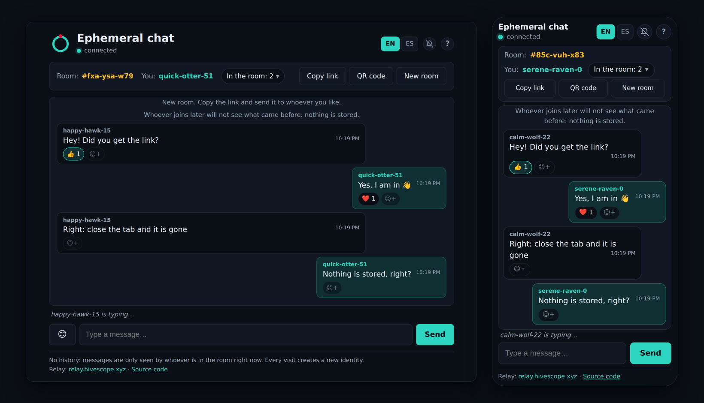

# Ephemeral chat for Nostr

*Leer en español: [README.es.md](README.es.md)*

**Live: https://chat.hivescope.xyz**

Ephemeral Nostr chat: a new random room and a new identity on every visit. Messages are encrypted with a key derived from the room link.

[](https://chat.hivescope.xyz)

A tiny web chat on top of a Nostr relay. Every time you open it, you get **a brand-new random room** and **a brand-new identity**. Share the link and whoever opens it is in the same room. Nothing is stored: close the tab and it is gone.

It connects to `wss://relay.hivescope.xyz` by default (any relay that accepts ephemeral events works).

## How it works

- **Ephemeral events** (kinds 20000–29999): relays forward them to whoever is subscribed and never store them.
  - `20001` — chat message
  - `20003` — reaction to a message (encrypted `{"e":"👍","on":true}` plus an `["e", <message id>]` tag; `on:false` removes it). Closed list: 👍 ❤️ 😂 😮 😢 🙏
  - `20002` — presence: join / heartbeat every 30 s, and "is typing" beats (at most one per 4 s while typing). Both payloads are encrypted and have the same length, so the relay cannot tell them apart; a `["bye"]` tag marks leaving. This is how the "who is here" list works, since there is no history to ask.
- **Identity**: a fresh secp256k1 key on every visit, kept in memory only. The nickname (e.g. `calm-otter-42`) is derived from the public key, so everybody sees the same one.
- **Room**: a random 80-bit id in the URL fragment (`#…`), which browsers never send to any server.
- **Privacy**: the room id derives (HKDF) an AES-GCM key. Message contents are encrypted with it, and the room tag published to the relay is a SHA-256 hash of the id. The relay operator sees who talks when and how much, but not what, and cannot join a room without the link. It is *not* a substitute for a vetted end-to-end protocol: anyone with the link can read and write, and there is no forward secrecy.
- **Relay**: the deployed build is pinned to one relay (`VITE_RELAY`, default `wss://relay.hivescope.xyz`), which allows a strict CSP. In development, or when built with `VITE_ALLOW_CUSTOM_RELAY=1`, you can pick another with `?relay=wss://…` or from the footer.
- **Reactions and emojis**: click ☺+ under a message to react; click your own reaction again to remove it. Late joiners do not see reactions sent before they arrived (nothing is stored). On desktop there is an emoji picker next to the message box; touch devices use their own keyboard.
- **Notifications**: the tab title always shows the unread count. The bell (off by default) adds a sound and, if the browser allows it, a system notification; notifications never contain the message text.
- **Sharing**: copy the link, the system share sheet (where available) or a QR code of the room link.
- **Links** in messages are clickable (http/https only, `noopener`, no referrer); **"X is typing…"** is shown above the message box.
- **Installable app (PWA)**: manifest, icons and a service worker that caches the app shell, so it opens without a connection (the chat itself needs the relay). A new version never takes over by itself: the app shows a bar ("Reload" / "Later") and checks for updates every 30 minutes and whenever you come back to the tab. iPhone: Share → Add to Home Screen; Android/desktop: the "Install app" button. Phone notifications only work in the installed app and only while it still runs in the background: there is no push server, so nothing reaches a closed app.
- **Languages and help**: English and Spanish, switch in the header; the ? button opens a help dialog. Defaults to the browser language.

## Develop

```bash
npm install
npm run dev        # http://localhost:5173
npm test           # unit tests (+ end-to-end if RELAY_URL is set)
RELAY_URL=wss://relay.hivescope.xyz npm test
npm run build      # static site in dist/
```

The build is a static site: serve `dist/` from anywhere over HTTPS (needed for the clipboard button and `wss://`).

### Deploy next to a relay (Caddy)

`scripts/deploy.sh` publishes the chat through the Caddy of a [nostr-relay-khatru](https://github.com/rzazo24/nostr-relay-khatru) deployment, with a strict CSP (`deploy/chat.caddy.template`):

```bash
./scripts/deploy.sh ~/path/to/nostr-relay-khatru chat.example.com wss://relay.example.com
```

It needs a DNS record for the chat domain pointing at the server, and the relay repo's Caddyfile to `import /etc/caddy/sites/*.caddy` with `./sites` mounted (already the case in recent versions).

The icons in `public/icons/` were rendered from `public/icon.svg` and `icons-src/full-bleed.svg` (the full-bleed version used for the maskable and Apple icons).

## Layout

| File | What it does |
|---|---|
| `src/chat.ts` | Room protocol: identity, publishing, subscription, presence |
| `src/crypto.ts` | Room topic hash and AES-GCM encryption |
| `src/relay.ts` | Minimal single-relay WebSocket client with reconnection |
| `src/reactions.ts` | Reaction state per message (closed emoji list) |
| `src/emojis.ts` | Emojis for the desktop picker |
| `src/roster.ts` | Who is online, from heartbeats |
| `src/linkify.ts` | Safe URL detection for messages |
| `src/typing.ts` | Who is typing right now |
| `src/notify.ts` | Bell: sound and system notifications |
| `src/qr.ts` | QR code of the room link |
| `public/sw.js`, `public/manifest.webmanifest` | PWA: service worker (per-build cache name stamped by `vite.config.ts`) and manifest |
| `src/names.ts` | Random room ids and nicknames |
| `src/i18n.ts` | English / Spanish texts |
| `src/main.ts` | UI |

## Known limits

- A relay may rate-limit ephemeral events per IP; a rejected message is shown in the chat.
- If nobody else is connected, a message reaches nobody (and some relays answer `mute: no one was listening`; this app always listens to its own room, so it does not trigger that).
- Whoever has the link can read everything written *while they are connected*; nothing is replayed to late joiners.

## License

MIT
